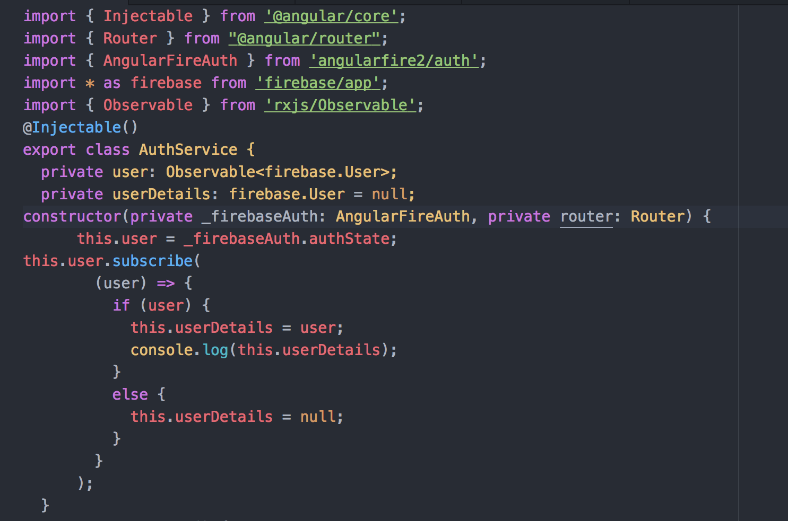
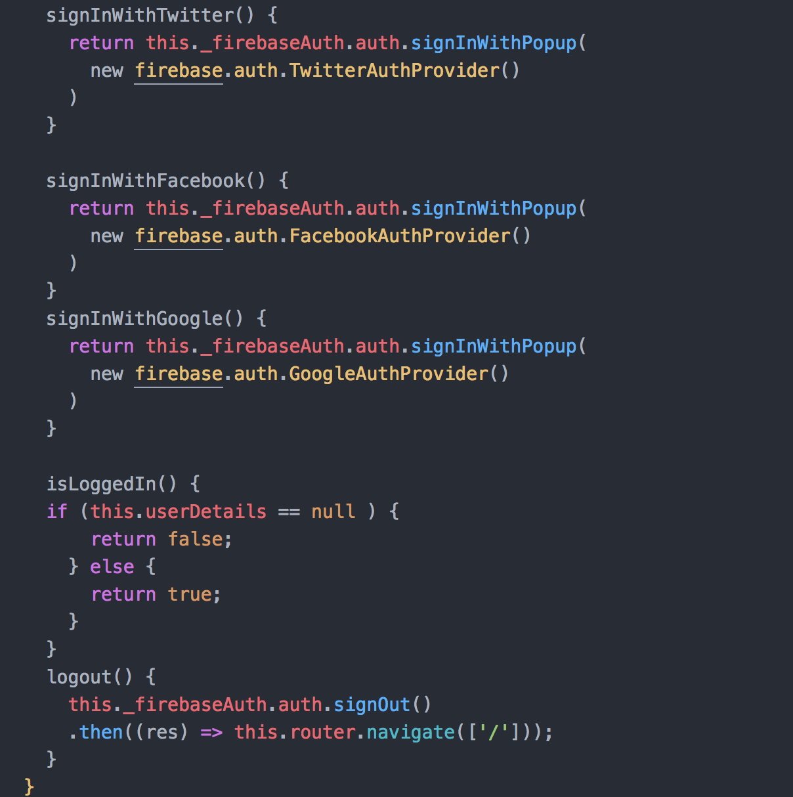
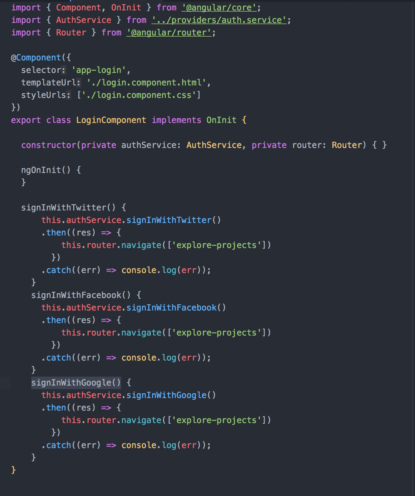
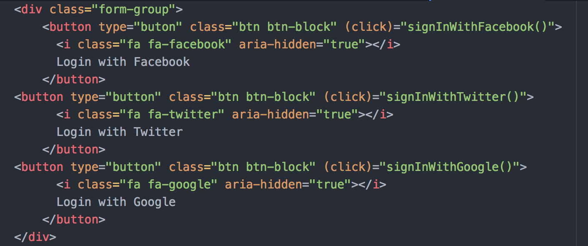
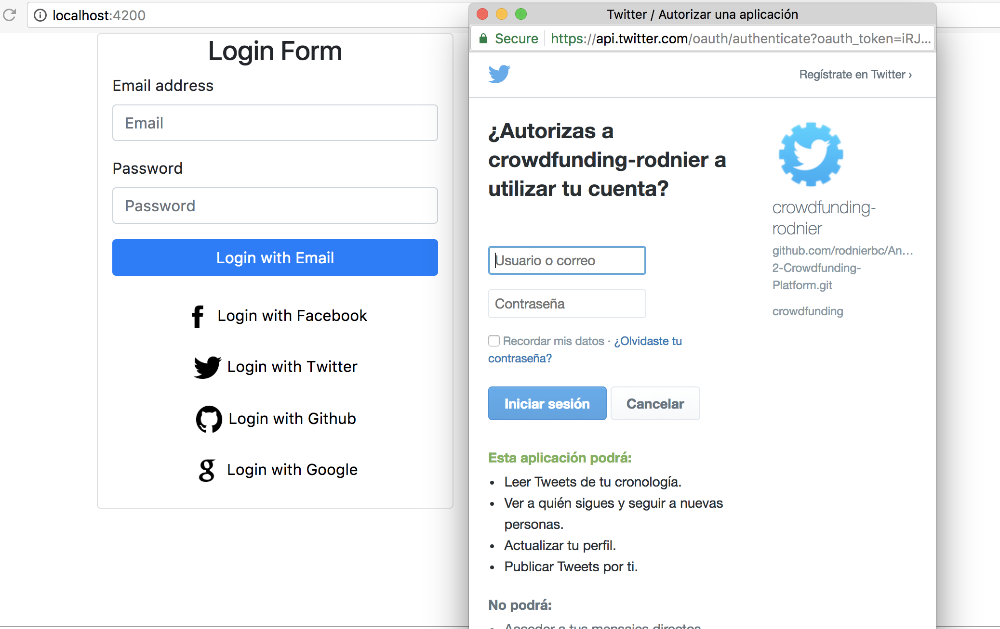

# Crowdfunding

This is a web application created with the aim of implementing basic functionalities on a data model, which consist of the realization of a (CRUD) on the model Project hosted in a non-relational database (Firebase), in addition to the implementation of search filters and functionalities for the authentication process.

##### By: Rodnier Borrego

* Clone github repository https://github.com/rodnierbc/Angular-2-Crowdfunding-Platform.git
* Open terminal and create _api-keys.ts_ file at the top of the project directory
* Create a new data base using firebase
* In _api-keys.ts_ file add the following code:
```sh
export var masterFirebaseConfig = {
  apiKey: "?",
    authDomain: "?",
    databaseURL: "?",
    storageBucket: "?",
    messagingSenderId: "?"
}
```
* In the previously mentioned code it is necessary to replace each interrogation symbol with the data that is provided by Firebase once the database is created.

* You can import certain test data found in the file firebase-data-structure.json into your database.

* Run terminal commands: npm install, ng build; ng serve


## Create a search pipe to dynamically filter results with Angular-2
A very common use case of this is to have an input box where a user enters a search text and the results are filtered appropriately.
In our application was necessary to integrate a filter in order to make it easy to search for a Project, because sometimes looking for a Project among hundreds of these can be very annoying.

### 1- Create the Filter Pipe
For pipe creation we use the following command:
```sh
$ ng g pipe filter-text
```
Let’s populate the pipe with code for the filter, Here is the code:

<p align="center"></p>

This code will return a subset of an array of _Projects_ if any project contains the searchText string in its property _title_. In the future we can extend our code to expand the search on other properties such as the category etc.

### 2- Use the Filter Pipe
In order to use the pipe, first we imported it into the app module and we created _Input_ box into the _explore-projects.component.html_ and including  _Two-way Binding_ using _ngModel_ directive, this allows the Project model _text_ variable to update the input when it changes and listen for changes on the input as well. Here is the code:
<p align="center"></p>

Then we included our filter in the _projects_ list into _ngFor_ directive. Here is the code:
<p align="center"></p>

### 3- Results
Now we should see an input box and below the table that contains some data of the projects.
<p align="center"></p>
If we type some text into the box and see that our list being dynamically filtered!
<p align="center"></p>

## Authentication  using Angular 2 and Firebase.
I was very curious about how the user authentication process works using Firebase and Angular 2, so I stopped to consult updated bibliography about the topic and try to implement the user authentication process on the Crowdfunding application.
Firebase Authentication provides backend services, easy-to-use SDKs, and ready-made UI libraries to authenticate users to our app. It supports authentication using passwords, popular federated identity providers like Google, Facebook and Twitter, Github etc.
### 1- Getting ready
The first thing we have to do is make sure to install angularfire2 and for that we use the following command:
```sh
$ npm install angularfire2 firebase --save
```
Then make sure to make the necessary configurations in our file _src/app/app.module.ts_ to import the important classes that will provide us some necessary methods and properties that will intervene in the user authentication process.

### 2- Create an auth service to implement the authentication
In our auth.service.ts file, we imported AngularFireAuth, firebase and Observable also we created an observable user variable, injected FirebaseAuth in the constructor.
The following image shows a capture of the source code of our service.

<p align="center"></p>

 Then we implemented methods that allow authentication using Facebook, Twitter, Google and we also include the isLoggedIn () and Logout () methods.
 The following image shows a capture of the source code of our service.

 <p align="center"></p>

### 3- Create login component.
In our login.component.ts file we imported the AuthService, injected it in the constructor and implemented signInWithTwitter(), signInWithFacebook() and signInWithGoogle() methods.
The following image shows a capture of the source code of our login component.

<p align="center"></p>

In our login.component.html file we added click functions for each buttons. See the code below:

<p align="center"></p>

### 3- Results
Now we can see that by clicking on the button for authentication with Twitter we access the login page of the Twiter application.
<p align="center"></p>

### 4- Conclusions
Even all the functionalities for the authentication process are not complete, but I am working on it.
Until the moment I thought it was very interesting to touch closely these topics and others closely related as the assignment of permissions based on roles since it is extremely important the security of our applications.
