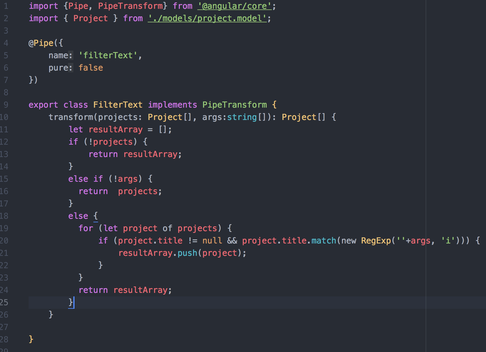
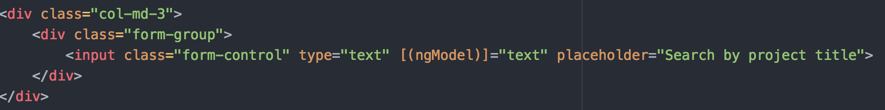
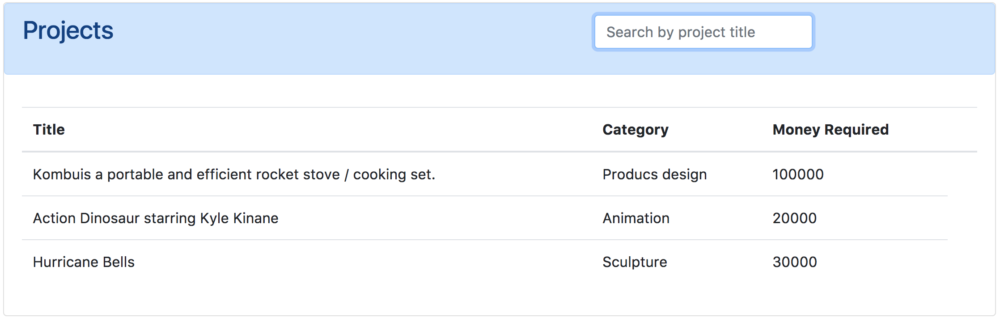
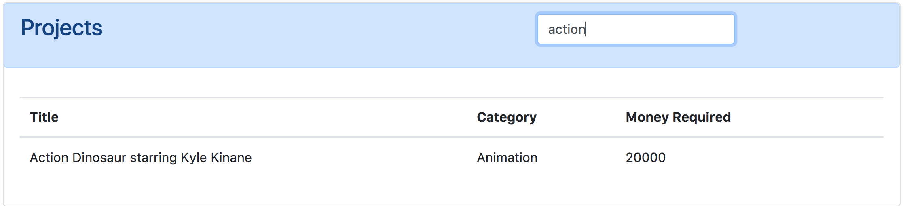

## Create a search pipe to dynamically filter results with Angular-2
A very common use case of this is to have an input box where a user enters a search text and the results are filtered appropriately.
In our application was necessary to integrate a filter in order to make it easy to search for a Project, because sometimes looking for a Project among hundreds of these can be very annoying.

### 1- Create the Filter Pipe
For pipe creation we use the following command:
```sh
$ ng g pipe filter-text
```
Let’s populate the pipe with code for the filter, Here is the code:

<p align="center"></p>

This code will return a subset of an array of _Projects_ if any project contains the searchText string in its property _title_. In the future we can extend our code to expand the search on other properties such as the category etc.

### 2- Use the Filter Pipe
In order to use the pipe, first we imported it into the app module and we created _Input_ box into the _explore-projects.component.html_ and including  _Two-way Binding_ using _ngModel_ directive, this allows the Project model _text_ variable to update the input when it changes and listen for changes on the input as well. Here is the code:
<p align="center"></p>

Then we included our filter in the _projects_ list into _ngFor_ directive. Here is the code:
<p align="center"></p>

### 3- Results
Now we should see an input box and below the table that contains some data of the projects.
<p align="center"></p>
If we type some text into the box and see that our list being dynamically filtered!
<p align="center"></p>
